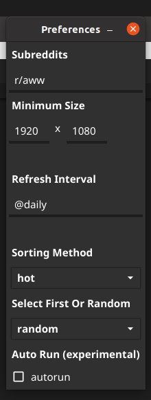

# go-reddit-wallpaper

A cross-platform software that changes your wallpaper everyday (with go!)

From top of the line subreddits and add your own:

- r/wallpaper
- r/wallpapers
- ( ͡° ͜ʖ ͡°)

# Screenshots




# Features

- custom subreddit
- minimal size
- custom interval with cron syntax
- sorting method
- auto run

# Installation

Download from [release page](https://github.com/borgmon/go-reddit-wallpaper/releases)

# Build from source

you will need fyne cmd package

```bash
go get fyne.io/fyne/cmd/fyne
```

## Build Linux

```bash
fyne package -os linux
```

## Build Windows

```bash
fyne package -os windows
```

## Build MacOS

```bash
fyne package -os darwin
```

# Todo

- unit tests (duh)
- login and upvote
